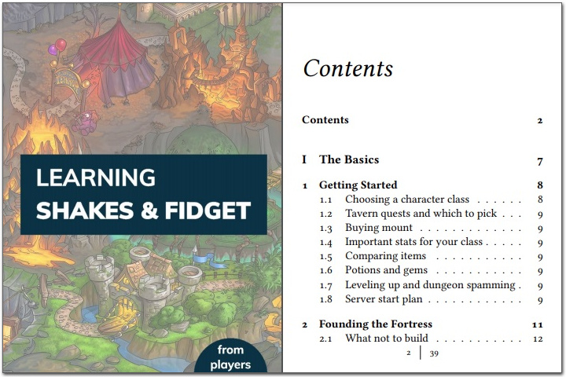

# sfbook

The goal of this project is to create a community book named "Learning Shakes and Fidget" for the Shakes and Fidget game.

The idea is to write a book that will be distributed for free, in ebook-compatible formats.

This repository contains the LaTeX code and all accompanying resources needed to compile the book.

### How to get the book

Click the screenshot below to get an unfinished copy of the book in PDF format (version 0.3.2):

Currently this is work in progress and if, and when it will be finished, is completely unknown.

So far the following chapters/topics are somewhat ready:

- [Chapter 2 - Founding the Fortress](https://learningsf.github.io/sfbook/learningsf.pdf#page=11)
- [Chapter 5 - Underworld](https://learningsf.github.io/sfbook/learningsf.pdf#page=50)
- [How to reach level 110+ in 3-4 days](https://learningsf.github.io/sfbook/learningsf.pdf#page=76)

At a later stage it might also be published in EPUB, MOBI or other formats.

### How to contribute

Anyone who has experience with the game is welcome to help. For example, you can help by writing a part of the book (eg. a chapter) or by creating an illustration/infographic for a specific topic.

Before writing anything, open an issue, so that others know what chapter you want to work at, in order to avoid duplicate effort.
You can check what content is currently being written in the [Projects tab](https://github.com/learningsf/sfbook/projects/1)

The book is written in LaTeX, with the LyX editor. The main file that contains all textual content is [learningsf.lyx](learningsf.lyx).
This is the file that you need to open and edit with the LyX editor after you checkout the repository.

Before making a pull request, compile the book to PDF with MiKTeX, and make sure the changes also look good in PDF format.

The specific version of those tools should not matter, but just in case, these are the ones that have been used so far:

- LyX editor, version 2.3.6.1
- MiKTeX, 21.2

### Credits

- chrisl21 (https://www.deviantart.com/chrisl21) for the book icon
- Google for the Mulish Variable font

### LICENSE

See [LICENSE.txt](LICENSE.txt) file
